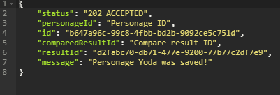
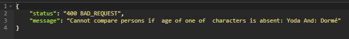

## StarWarsSpringBoot app

Application works with external API: [The Star Wars API](https://swapi.co/)  and counts age difference of characters from Star Wars, telling which  one is older(bigger birth year means that character is older). 
You must enter the name of the character, after that program will select a random character and compares the birth years of both. The result will be saved and you will receive an ID on which you can get the result of the comparison.
After you start the program, it is recommended to go to the link below to see a brief instruction and a list of characters.
 ```
http://{app.host}/
 ```
 
by default app running on localhost:8080. If it runs on other host you must go to:

```
src/main/resources/application.properties
 ```
And change property from:
```
app.host=localhost:8080
 ```
 to: 
 ```
 app.host={your host here}
  ```
if you want to know more about Star Wars API [click here](https://swapi.co/)
 ## Getting Started
 
 ### Prerequisites
 
 To run this application you will need next:
 
 ```
 Git
 JDK 8 
 Maven 3.6.0 or later
 ```
 
 ### Clone
 
 At first you should clone project by Git using URL
 
 ```
 git clone https://github.com/TarasTkhir/gl-basecamp-2019-spring-framework-final-project.git
 ```
 
 ### Running the tests
 
 After cloning you can run all tests. To run Tests you have to open command line, choose folder with cloned project and write:
 ```
 mvn test
 ```
 Or you can use your IDE.
 ### Build an run
 
To run application from the command line you have to open command line, choose folder with cloned project and write:
 
 ```
 mvn spring-boot:run
 ```
 Or you can use your IDE.
 
 Or you can build a single executable War file that contains all the necessary dependencies, classes, and resources with:
 ```
 mvn clean package
 ```
 
 ##Endpoints
 
 #####Application use next mappings:
  To see characters names that required to use and short instruction see:
  ```
  http://localhost:8080/
  ```
 To add character by name (by name that required to use) and get ID's of saved character and saved result:
   ```
  http://localhost:8080/add/{name}
   ```
   
   
   p.s. If character or random generated character does not have a specified age, you will get message about about the fact that one of the characters does not have a prescribed age.
   
   
   
To find personage by ID that was given you after "/add/name" you can use:
 ```
 http://localhost:8080/find/{id}
 ```
To find all characters that were added:  
```
http://localhost:8080/findAll
```

To find result of a comparison of two characters, you need to write result ID that was given you after "/add/name" :
```
http://localhost:8080/findResult/{id}
```
To find all results of the comparison of two characters:      
```
http://localhost:8080/findAllResults
```
 
 ## Author
 
 * **Taras Tkhir** - [GitHub link](https://github.com/TarasTkhir/)
